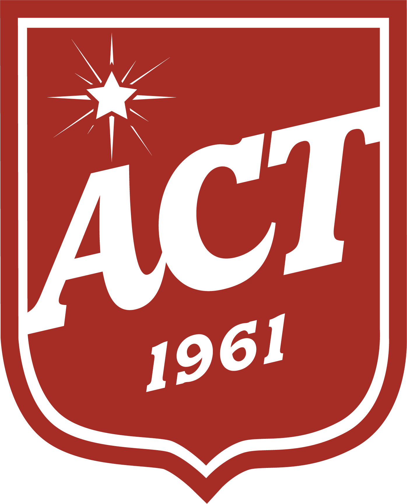

#  {#splash data-background-image="assets/splash.jpg" data-background-size="cover"}

#  {#title data-background-image="assets/splash.jpg" data-background-size="cover"}

{.title-logo width=120}

::: {.title-row}
[**Are colonisers really heroic?**]{.slide-title}
:::

::: {.shield}
[Let's read and find out.]{.cta-text}
:::

::: notes
Rhetorical question to provoke thinking. Elicit initial ideas from the class.
:::

# Objectives {#objectives}

+------------------------------------------------------------------+
| **1.** Identify different opinions about Christopher Columbus in |
| a reading text.                                                  |
+------------------------------------------------------------------+
| **2.** Distinguish facts from opinions.                          |
+------------------------------------------------------------------+
| **3.** Express and support my own opinions using a structured    |
| framework.                                                       |
+------------------------------------------------------------------+

::: notes
Read through the objectives to give students a roadmap for the lesson.
:::

# Answer the questions as we watch. {#video-preview}

+-----------------------------------------------------------------+
| **1.** What was the **Walk for Reconciliation**? (When? Who?    |
| How many?)                                                      |
+-----------------------------------------------------------------+
| **2.** What events **led up to** the bridge walk?               |
+-----------------------------------------------------------------+
| **3.** Why is reconciliation still **needed today**?            |
+-----------------------------------------------------------------+

::: notes
These are gist questions — main ideas only. Play the BTN video once.
:::

#  {#video}

::: {.youtube}
SCW0BWf_Jys
:::

::: notes
Play BTN "Bridge Walk Anniversary" (2:27). Give 2 min pair check after.
:::

# What did you find out? {#video-feedback}

1. [28 May 2000 · Sydney Harbour Bridge · 250,000+ · Indigenous + non-Indigenous]{.fragment .answer-reveal}

2. [1991 Reconciliation Council · 1992 Redfern Speech · Mabo decision · Native Title Act · Stolen Generations]{.fragment .answer-reveal}

3. [Still fighting for recognition, equality, justice — **"still a long way to go"**]{.fragment .answer-reveal}

::: notes
Reveal one at a time. Pause after each for discussion.
:::

# Christopher Columbus — Hero or Villain? {#transition-columbus data-background-color="#c0392b"}

::: notes
Phase shift from BTN video to the reading text about Columbus.
:::

#  {#columbus-image data-background-image="assets/columbus.jpg" data-background-size="cover"}

::: {.shield}
Who was Christopher Columbus? What is he famous for?
:::

::: notes
Elicit: Italian explorer, 1492, "discovered" America. Bridge: "Some people call him a hero. Others call him a villain. Today we're going to look a little deeper."
:::

# Let's look a little deeper… {#transition-deeper data-background-color="#c0392b"}

::: notes
Phase shift from elicitation to vocabulary and reading.
:::

#  {#vocab-navigator}

/ˈnævɪɡeɪtə/

[**navigator**]{.fragment .answer-reveal data-audio-src="assets/vocab-navigator.mp3"}

[Before GPS, a navigator used the stars to guide ships across oceans.]{.fragment .answer-reveal}

::: notes
Phonemic script visible first. Click to reveal word + audio. Click for context. Concept check: "Did a navigator drive a car or guide a ship?"
:::

#  {#vocab-colonisation}

/ˌkɒlənaɪˈzeɪʃən/

[**colonisation**]{.fragment .answer-reveal data-audio-src="assets/vocab-colonisation.mp3"}

[The colonisation of Australia meant Indigenous people lost their land and culture.]{.fragment .answer-reveal}

::: notes
Phonemic script visible first. Click to reveal word + audio. Click for context. Concept: "Is colonisation about settling or visiting?"
:::

#  {#vocab-enslaved}

/ɪnˈsleɪvd/

[**enslaved**]{.fragment .answer-reveal data-audio-src="assets/vocab-enslaved.mp3"}

[During the voyage, Columbus enslaved many native people and forced them to work.]{.fragment .answer-reveal}

::: notes
Phonemic script visible first. Click to reveal word + audio. Click for context. Concept: "Is an enslaved person free or not free?"
:::

#  {#vocab-immoral}

/ɪˈmɒrəl/

[**immoral**]{.fragment .answer-reveal data-audio-src="assets/vocab-immoral.mp3"}

[Most people now agree that it is immoral to treat other human beings as property.]{.fragment .answer-reveal}

::: notes
Phonemic script visible first. Click to reveal word + audio. Click for context. Concept: "Is helping someone immoral? What about hurting someone?"
:::

#  {#vocab-ruthless}

/ˈruːθləs/

[**ruthless**]{.fragment .answer-reveal data-audio-src="assets/vocab-ruthless.mp3"}

[A ruthless leader does not care who gets hurt as long as they get what they want.]{.fragment .answer-reveal}

::: notes
Phonemic script visible first. Click to reveal word + audio. Click for context. Concept: "Does a ruthless person care about others' feelings?"
:::

# Reading Challenge {#reading-challenge}

::: {.split-list}
|  |  |
|---|---|
| <i class="fa-solid fa-book-open"></i> | **[Standard]{.highlight}** — Read the text and answer the questions with them visible while you read. |
| <i class="fa-solid fa-pencil"></i> | **[Advanced]{.highlight}** — Read the text without looking at the questions. Take notes, then answer from your notes. |
| <i class="fa-solid fa-star"></i> | **[Elite]{.highlight}** — Read the text once. Do not take notes. Answer from memory. |
:::

::: notes
All students read the same text (pp. 38–39). The access method differs per tier.
:::

# Exercise 1 {#transition-ex1 data-background-color="#c0392b"}

# Getting Ready {#skill-ex1}

**Skill:** Activating prior knowledge

Before you read, look at the title and picture on p. 39. What do you already know about Christopher Columbus?

# Exercise 1 {#task-ex1 data-timer="180"}

Read the introduction (first paragraph on p. 39) and answer:

1. Who was Christopher Columbus? What is he famous for?
2. Why might people disagree about his reputation?

::: notes
Students read the intro paragraph and answer the two questions in their tier mode. 3 min timer.
:::

# Check Your Answers {#answer-ex1}

1. [Columbus was an Italian explorer who sailed from Spain in 1492 and reached the Americas.]{.fragment .answer-reveal}

2. [Some see him as a brave explorer who opened up the New World. Others see him as a greedy invader who harmed Indigenous people.]{.fragment .answer-reveal}

::: notes
Reveal each answer on click. Discuss: which view do students lean towards?
:::

# Exercise 2 {#transition-ex2 data-background-color="#c0392b"}

# Reading for Opinion {#skill-ex2}

**Skill:** Identifying the writer's attitude

Look for words that show the writer's feeling — positive words (*courageous, amazing achievement*) vs negative words (*ruthlessly, inaccurate*). These tell you the writer's opinion.

# Exercise 2 {#task-ex2 data-timer="300"}

Read both comments (Anna Craig and Guillermo Delgado on pp. 38–39).

What is each writer's overall opinion of Christopher Columbus? Highlight words that show their attitude.

::: notes
Students read in their tier mode. 5 min timer. Highlight attitude words.
:::

# Check Your Answers {#answer-ex2}

1. [Professor Anna Craig thinks Columbus was a **brave explorer** who built a bridge between the Old and New Worlds. She excuses his cruelty as "a man of his times."]{.fragment .answer-reveal}

2. [Dr. Guillermo Delgado thinks Columbus was **mean and self-interested**. He says Columbus didn't discover America — he invaded it and destroyed native cultures.]{.fragment .answer-reveal}

::: notes
Reveal each answer. Compare: whose argument is stronger? Why?
:::

# Exercise 3 {#transition-ex3 data-background-color="#c0392b"}

# Reading for Detail {#skill-ex3}

**Skill:** Scanning for specific information

Find key words from each question in the text. Read the sentences around them for the answer.

# Exercise 3 {#task-ex3 data-timer="300"}

Answer the comprehension questions on p. 38. Use your scanning skill to find the answers in the text.

::: notes
Students answer in their tier mode. 5 min timer.
:::

# Answer 1 {#answer-ex3a}

::: {.split-list}
|  |  |
|---|---|
| **Question** | 1 — Paragraph 1 (Craig) |
| **[Answer]{.highlight}** | Craig describes Columbus's difficult childhood and determination to build him up as a heroic figure. |
| **[Reason]{.highlight}** | She tells the story of a poor boy working on boats at age ten — this makes his later success seem earned and impressive. |
| **[Evidence]{.highlight}** | *"Imagine coming from a poor family in 15th century Europe. You start working on boats when you are only ten years old… Life is difficult, but you're determined to succeed, and eventually you become one of the best navigators in the world."* |
:::

::: notes
Ask: Why does Craig start with his childhood? What effect does it have on the reader?
:::

# Answer 2 {#answer-ex3b}

::: {.split-list}
|  |  |
|---|---|
| **Question** | 2 — Paragraph 3 (Craig) |
| **[Answer]{.highlight}** | Craig says slavery was "clearly immoral" but was accepted in the 15th century — Columbus was "a man of his times." |
| **[Reason]{.highlight}** | She doesn't approve of slavery, but argues we should judge Columbus by his era's standards, not modern values. |
| **[Evidence]{.highlight}** | *"Slavery is clearly immoral, but in the 15th century, it was an accepted part of life. Columbus was simply a man of his times."* |
:::

::: notes
Ask: Do you agree with her reasoning? Can we excuse historical figures because "everyone did it"?
:::

# Answer 3 {#answer-ex3c}

::: {.split-list}
|  |  |
|---|---|
| **Question** | 3 — Paragraph 4 (Craig) |
| **[Answer]{.highlight}** | Craig says Columbus built a bridge between the Old and New Worlds, starting the modern age through exchange of culture and ideas. |
| **[Reason]{.highlight}** | This is the climax of her argument — Columbus is presented as a connector, not an invader. |
| **[Evidence]{.highlight}** | *"Columbus built a bridge between the Old and New Worlds, creating an exchange of culture and ideas. Thanks to Columbus, a new modern age began, changing the world forever."* |
:::

::: notes
The "bridge" metaphor is key. Ask: Is a bridge always positive? What travels both ways?
:::

# Answer 4 {#answer-ex3d}

::: {.split-list}
|  |  |
|---|---|
| **Question** | 4 — Paragraph 2 (Delgado) |
| **[Answer]{.highlight}** | Delgado says Native Americans discovered the Americas first (they already lived there), plus Leif Erikson arrived 500 years before Columbus. |
| **[Reason]{.highlight}** | He challenges the word "discovery" with two counter-arguments: the existing population and the earlier European arrival. |
| **[Evidence]{.highlight}** | *"In 1492, there were already millions of people living there. In addition, the first European had arrived there 500 years earlier — his name was Leif Erikson."* |
:::

::: notes
If Columbus didn't discover America, what DID he do? Is "discovery" the right word?
:::

# Answer 5 {#answer-ex3e}

::: {.split-list}
|  |  |
|---|---|
| **Question** | 5 — Paragraph 3 (Delgado) |
| **[Answer]{.highlight}** | Delgado says Columbus was motivated by economics — wealth and power — not by exploration. |
| **[Reason]{.highlight}** | Delgado reframes the voyage as a business venture. When Columbus didn't find gold, he turned to enslaving people for profit. |
| **[Evidence]{.highlight}** | *"Columbus' voyage was about economics, not exploration. He wanted wealth and power. … Columbus found little gold or silver in the Americas, so he decided to make money another way — by ruthlessly making native people slaves."* |
:::

::: notes
Does this change how you see Columbus compared to Craig's version?
:::

# Fact or Opinion? {#transition-factop data-background-color="#c0392b"}

::: notes
Phase shift from comprehension to critical analysis.
:::

# Fact vs. Opinion {#fact-opinion-intro}

::: {.click-table}
|  |  |  |
|---|---|---|
| **Fact** | can be proven. It is true for everyone. | **FACT:** Columbus sailed from Spain in 1492. |
| **Opinion** | what someone thinks or feels. People can disagree. | **OPINION:** Columbus was a brave explorer. |
:::

::: notes
Click through rows. Ask after each: How do you know this is a fact/opinion?
:::

# Pair 1 — Columbus {#answer-ex4a}

::: {.left-table}
|  |  |
|---|---|
| **1a.** Columbus was an Italian explorer. | [**Fact** — Historical records confirm he was Italian and made the voyage in 1492.]{.fragment .answer-reveal} |
| **1b.** Columbus was a brave explorer. | [**Opinion** — "Brave" is a judgement. Different people might disagree.]{.fragment .answer-reveal} |
:::

::: notes
Ask: Why is 1a a fact? Why is 1b an opinion?
:::

# Pair 2 — The Pacific {#answer-ex4b}

::: {.left-table}
|  |  |
|---|---|
| **2a.** The Pacific is the largest ocean. | [**Fact** — Scientifically measurable. It is the largest ocean by surface area.]{.fragment .answer-reveal} |
| **2b.** The Pacific is the most difficult ocean. | [**Opinion** — "Most difficult" is subjective. Depends on experience.]{.fragment .answer-reveal} |
:::

::: notes
Ask: What makes 2a a fact? What makes 2b an opinion?
:::

# Pair 3 — Spices {#answer-ex4c}

::: {.left-table}
|  |  |
|---|---|
| **3a.** Columbus brought spices from the Americas. | [**Fact** — Historical records confirm he brought back new plants.]{.fragment .answer-reveal} |
| **3b.** Spices improve the taste of dishes. | [**Opinion** — "Improve" is a value judgement. Not everyone likes the same flavours.]{.fragment .answer-reveal} |
:::

::: notes
Ask: Can we prove 3a? Is 3b true for everyone?
:::

# Pair 4 — Skill {#answer-ex4d}

::: {.left-table}
|  |  |
|---|---|
| **4a.** Columbus was a talented sailor. | [**Opinion** — "Talented" is a judgement. Others might disagree.]{.fragment .answer-reveal} |
| **4b.** Columbus started sailing at ten. | [**Fact** — Biographical detail from historical sources.]{.fragment .answer-reveal} |
:::

::: notes
Ask: Why is 4b a fact? Why is 4a an opinion?
:::

# Building Strong Opinions {#transition-structured data-background-color="#c0392b"}

::: notes
Phase shift from identifying opinions to forming their own.
:::

# Structured Opinions {#structured-opinions}

::: {.split-list}
|  |  |
|---|---|
| **Opinion** | *I think Columbus was/was not a hero because…* |
| **Reason** | *The main reason is…* |
| **Evidence** | *For example, when / who / what / where / how / why…* |
:::

::: {.block}
**Teacher model:**

I think Columbus was **not** a hero. The main reason is that he harmed Indigenous people. **When** he arrived in 1492, **who** were already there? Millions of people. **What** happened? He enslaved them. **Where**? In the Americas. **How**? It destroyed their cultures.
:::

::: notes
Students write their own structured opinion. Volunteers share.
:::

# Think. Pair. Share. {#think-pair-share}

**Ex 8 Q1:** Why can a person be a hero and a villain to different people?

**Think** — Write your ideas (1 min)

**Pair** — Discuss using the structured opinion framework (2 min)

**Share** — Share with the class (2 min)

::: notes
Elicit 3–4 pairs. Wrap up: "History depends on who tells the story — and what they want you to believe."
:::

#  {#end}

**M3 — Columbus: Hero or Villain?**

B2 | Receptive Skills
