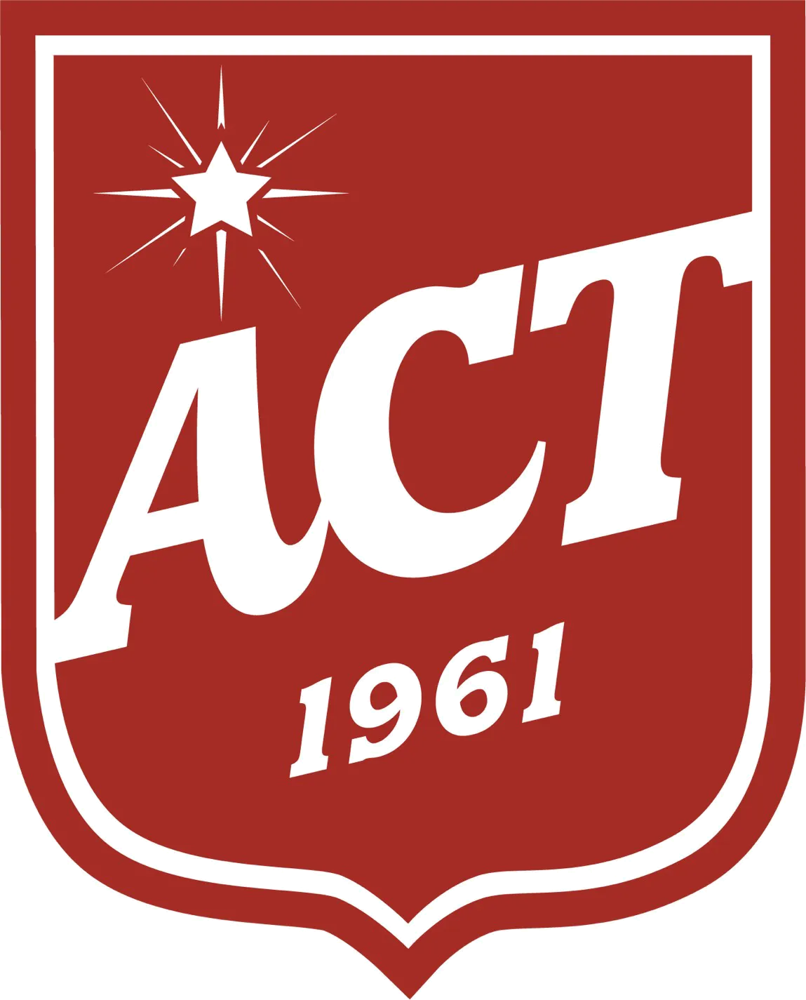

<!-- slide: 0 -->
<!-- slide-section: title -->
<!-- .slide: data-background-gradient="linear-gradient(to bottom, #2c3e50, #3498db)" -->

# Test Topic B2

*Exploring Test Topic*

---

<!-- slide: 1 -->
<!-- slide-section: objective -->
## Here's what you'll be able to do

- Read and understand the main ideas

*These are the same skills you need for the PET reading test!*

---

<!-- slide: 2 -->
<!-- slide-section: leadin -->
<!-- .slide: data-background-gradient="linear-gradient(to bottom, #667eea, #764ba2)" -->
## Let's get Started

### What do you see? What do you wonder?

Notes:
Display the photo. Give students 20 seconds to look silently.
Then ask the question. Elicit 3-4 responses.
Connect responses to today's topic: Test Topic.
- Discuss photos.
- Share ideas.
Goal: To activate interest in the theme

---

<!-- slide: 3 -->
<!-- slide-section: vocab-1 -->
<!-- .slide: class="vocab-slide" data-background-gradient="linear-gradient(to bottom, #667eea, #764ba2)" -->
## Important Words

**empathy**
_/ˈempəθi/_

*She showed **empathy** when her friend was sad.*

---

<!-- slide: 4 -->
<!-- slide-section: vocab-2 -->
<!-- .slide: class="vocab-slide" data-background-gradient="linear-gradient(to bottom, #667eea, #764ba2)" -->
**generational**
_/ˌdʒenəˈreɪʃənl/_

*There is a **generational** difference. My grandparents do not use smartphones.*

---

<!-- slide: 5 -->
<!-- slide-section: vocab-3 -->
<!-- .slide: class="vocab-slide" data-background-gradient="linear-gradient(to bottom, #667eea, #764ba2)" -->
**resolve**
_/rɪˈzɒlv/_

*They sat down and tried to **resolve** their problem.*

---

<!-- slide: 6 -->
<!-- slide-section: transition-2 -->
<!-- .slide: data-background="#c0392b" -->
## What's the idea?

What do you think the text is about?

Notes:
Moving from Lead-in.
Give students a moment to reset. Introduce the next activity.

---

<!-- slide: 7 -->
<!-- slide-section: prereading -->
<!-- .slide: data-background-gradient="linear-gradient(to bottom, #f5f0eb, #e8ddd3)" -->
## Before you read

- What is the writer trying to do?
- What solution might they suggest?

Notes:
Students read the title and look at the photo.
Give them 30 seconds to share predictions in pairs.
Write 2-3 predictions on the board.
Materials: Student Book, pp 10-12

---

<!-- slide: 8 -->
<!-- slide-section: summary -->
## What you can do now

✓ I can understand and talk about the topic

Notes:
Elicit from students: What did you learn today?
Connect back to their predictions from the beginning.
Praise effort, mention one thing to improve.

---

<!-- slide: 9 -->
<!-- slide-section: end -->
<!-- .slide: data-background="#2c3e50" -->
## Thank you

*Test Topic* | B2